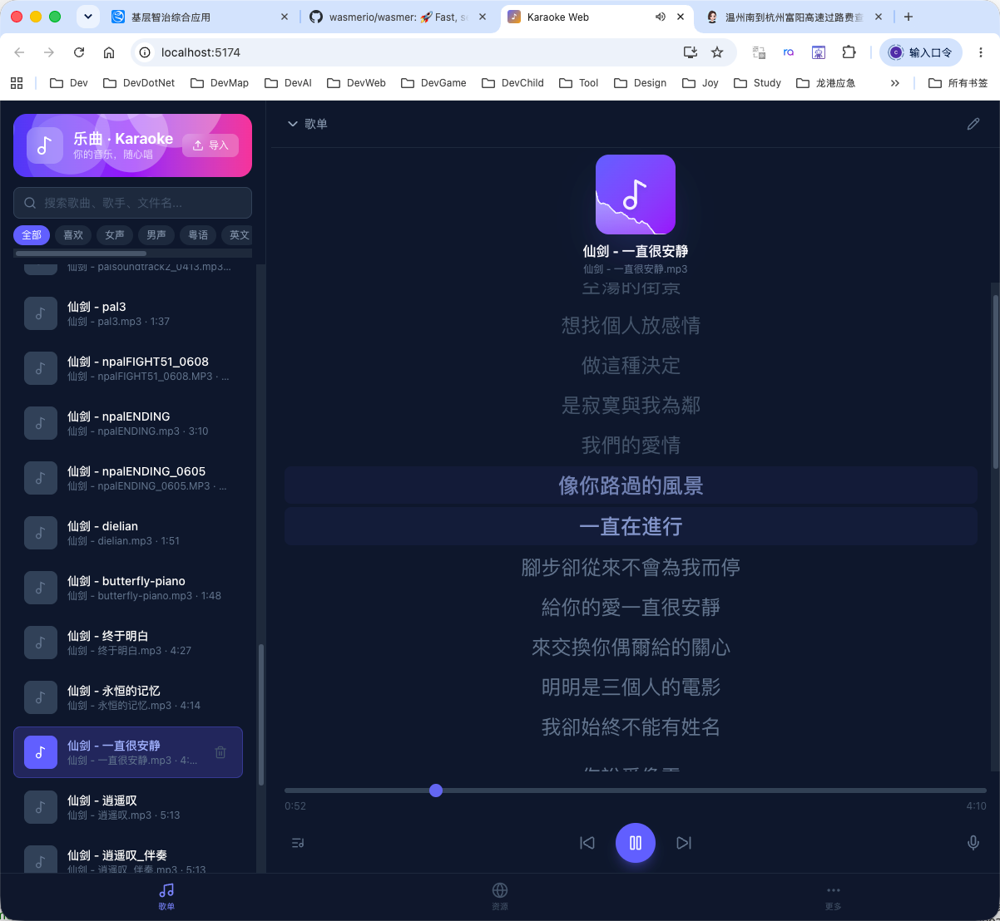
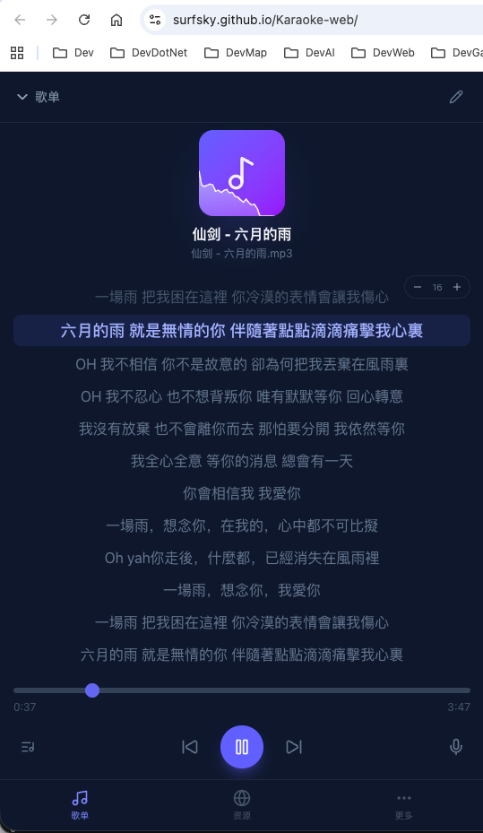
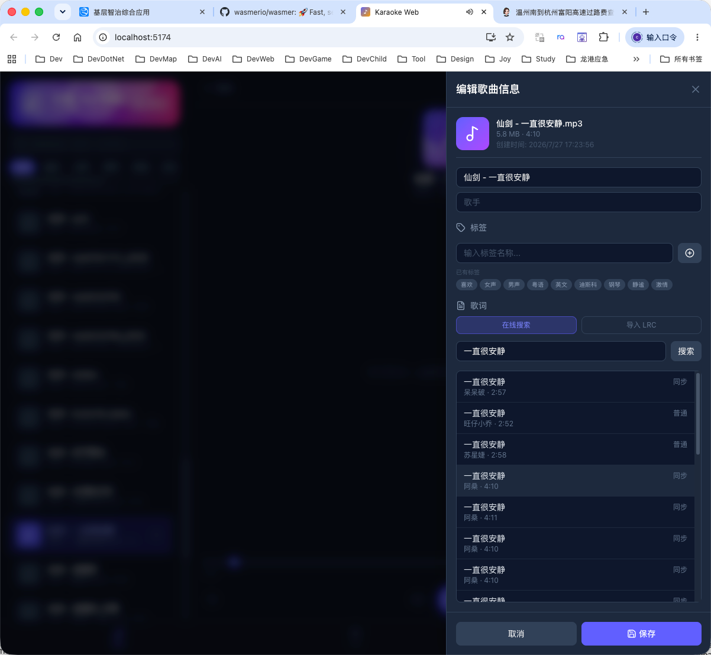

# Karaoke-web

用typescript + demucs wasm + ffmpeg wasm 构建的音乐软件

    1. 歌单，可指定本地音乐目录，可根据标签进行管理和检索；
    2. 播放：音乐+歌词；
    3. k歌：可调整原唱、伴奏、节拍器、麦克风、调音台（均衡器）等能力；
    4. 音乐资源及下载；
    5. pwa应用；
    6. 打包成各平台应用；

